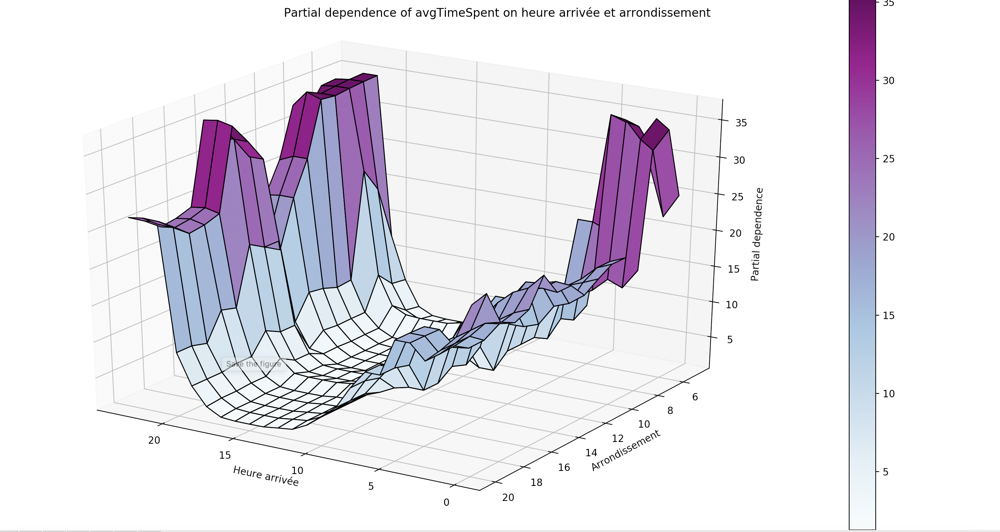
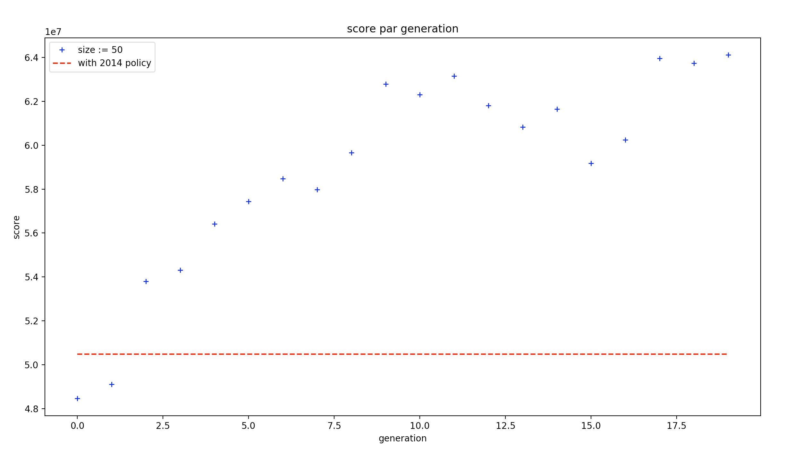

# OWDC
OW Datacase - Equipe Mines Paristech / 2018

## Le datacase : 

```html
L’OW data case challenge est un concours consistant à résoudre une étude de cas business en appliquant des compétences analytiques à un ensemble de données réelles - en l'occurrence des données de la ville de Paris
```

Nous nous sommes donc penchés sur la question du princing des places de parkings dans la ville de Paris.

## L'équipe :

Notre équipe est constituée de quatre personnes : 

- Paul Garnier (MINES Paristech)
- Marc-Adrien Gergaud (ESCP Europe - MINES Paristech)
- Théophane Gregoir (MINES Paristech - Semestre à l'étranger MIT)
- Arthur Verrez (MINES Paristech)

# Explications : 

## Data : 

- Quelques graphes en .png, et les données de l'API de la Mairie de Paris sur les différents arrondissements [Paris Open Data : arrondissements](https://opendata.paris.fr/explore/dataset/arrondissements/table/), sous la forme d'un fichier GeoJson. Ce fichier est utilisé avec [folium](https://github.com/python-visualization/folium) pour créer des cartes. 
- Par exemple, le tracé des dépendances entre le temps passé par les utilisateurs, en fonction des arrondissements et de l'heure d'arrivée : 



- Les data en .npy ne sont pas disponibles sur le git.


## Map : 

- Quelques script en .py pour la création des cartes folium. Ils ne sont cependant compatibles qu'avec nos fichier .npy. 
- Plusieurs exemples de cartes folium en .html. Pour les utiliser/afficher, récupérer le code source et l'enregistrer dans un fichier en .html. 
- Par exemple, avec [map arrondissement](https://github.com/DonsetPG/OWDC/blob/master/Map/arrondissement-map-test.html), vous allez pouvoir afficher une carte présentant différentes caractéristiques par Arrondissement (temps passés, fréquentations, coût moyen, taux d'utilisateurs rotatifs et taux de carte bleue), ainsi que des parkings souterrains présents dans Paris (en bleu). 


## ScriptPython : 

- {Data,Map,Graph}Maker : fichiers .py permettant la construction de la majorité de nos cartes, graphes, et des tableaux utilisés dans nos calculs.
- AI : Programme permettant les simulations de nos environnements (GA,NN,RP) et des calculs de revenues. 
- Exemple de résultats de l'AG (20 générations seulement, pour l'exemple) : 



# _______________________________________________________________
# _______________________________________________________________


# _______________________________________________________________
# _______________________________________________________________


# Pour l'équipe : 

## Aides : 

- Pour les fichiers .html : ouvrir, cliquer sur "Raw", copier-coller le texte :
```html
<!DOCTYPE html>
<head>    
    <meta http-equiv="content-type" content="text/html; charset=UTF-8" /> .......
 ```
dans un éditeur de texte (atom, visual studio code,...) et changer l'extension de .txt en .html (sur votre ordinateur) : plus qu'à l'ouvrir. 
Sur la droite : un filtre pour afficher les différentes data, les légendes sont en haut.

- préalablement installer Panda, numpy, et si autre errors du type : 
```python
Traceback (most recent call last):                                                                                                             
  File "script.py", line 21, in <module>                                                                                                
     import pandas as pd                                                                                                                        
 ImportError: No module named pandas
 ```
 
 Vérifier que pip est installé par :
 
 ```python
 pip --version
 ```
 sinon, go sur : https://pip.pypa.io/en/stable/installing/
 
 et : 
 
 pour tout les modules (exemple avec pandas) : 
 
 ```python
pip install pandas
 ```
 
- 3 fichiers de data : le principal en contient 24millions. Il y en 2 samples sur le drive, sinon le fichier Data_tuto permet de les extraire en .npy et les utiliser en matrice numpy ensuite via 

```python
dataset = np.load("/path/name_file.npy")
```


